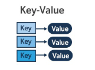

# Lab on Non-Relational Data Models: Key Value Data Model
<div align="center">

## Team 404

</div>

### Members
| Adm No.           | Name                                                                                                                                                                                                                                                                                     |
|:-----------------|:-------------------------------------------------------------------------------------------------------------------------------------------------------------------------------------------------------------------------------------------------------------------------------------------|
| **223405** | David Gathage                                                                                                                         |
| **224160** | Stephen Okwiri                                                                                            |
| **122182** | Alan Logedi                                                                                                               |
| **133834** | Sarah Mongare                      


## Overview
Key-Value Data Model is a non-relational database model with a simple structure where data is stored as a pair of a unique key and its associated value. It is optimized for fast read and write operations often in memory. It is designed to scale horizontally across distributed systems. It is also schema-flexible.

Its uses include: caching, session storage in web applications and high speed real time data retrieval.

Examples include DynamoDB and Redis.

<div align="center">
  
</div>

---
## Lab Requirements

This lab simulates the key-value data model using Redis, it applies it to product inventory data and performs CRUD operations using Python.

### Set-up Instructions
#### Required Software
- Docker
- Redis via Docker
- Python  version 3.8+
- Visual Studio Code
- VS Code Extension: Docker
- Git and Git Bash
- Github Desktop

Approximate Time Required: 1hour

## Step 1: Create a Github Repository
In Github Desktop, go to File, click on create new repository: give it a name(CAT-2-Team-404) and publish to Github.

From here, your group members can clone:
```bash
git clone https://github.com/sokwiri/CAT-2-Team-404.
```

## Step 2: Start Redis with Docker and Install Python Dependencies
```bash
docker-compose up -d
```
Verify:
```bash
docker ps
```
```bash
pip install redis
```
---
## Step 3: Load the Sample Data
Go into the scripts folder and run the import_data.py file to load `products.json` into Redis using `product_id` as keys.

```bash
cd scripts
python import_data.py
```
Output is:
```
Successfully imported 20 products into Redis.
```

## Step 4: Perform CRUD operations
### Applied Scenario: Product Inventory
E-commerce systems often require rapid lookup of product information by unique ID. A key-value store like Redis is ideal due to:
1. Quick access
2. Simplicity
3. Scalability

Use `interact_with_redis.py` to:
- Add new products(Create)
- Read product details(Read)
- Update values (e.g., price, stock)(Update)
- Delete entries(Delete)

```bash
python interact_with_redis.py
```
### Visuals and Outputs
#### Example Use:
1. Adding New Data


```redis
SET prod_1021 '{"name": "Wireless Headphones", "category": "Electronics", "price_KES": 2500.00, "in_stock": true, "quantity": 15, "rating": 4.5}'
```
The expected output for this is:
```
OK
```
2. Read the Data
To verify the data was added:
```redis
GET prod_1021
```
Output:
```json
{

  "name": "Wireless Headphones",
  "category": "Electronics", 
  "price_KES": 2500.00,
  "in_stock": true,
  "quantity": 15,
  "rating": 4.5
}
```

3. Update the Data
To update the price and quantity:
```redis
SET prod_1021 '{"name": "Wireless Headphones", "category": "Electronics", "price_KES": 2200.00, "in_stock": true, "quantity": 12, "rating": 4.5}'
```
Output:
```
OK
```

4. Delete the Data
To remove a product from the database:
```redis
DEL prod_1021
```
Output:
```
(integer) 1
```

To verify deletion:
```redis
GET prod_1021
```
Output:
```
(nil)
```

## Group Collaboration Summary
- David Gathage, - Setup & Scripts
- Stephen Okwiri - Docker & Markdown Guide
- Alan Logedi - Data Generation & Testing
- Sarah Mongare - Documentation & Reporting